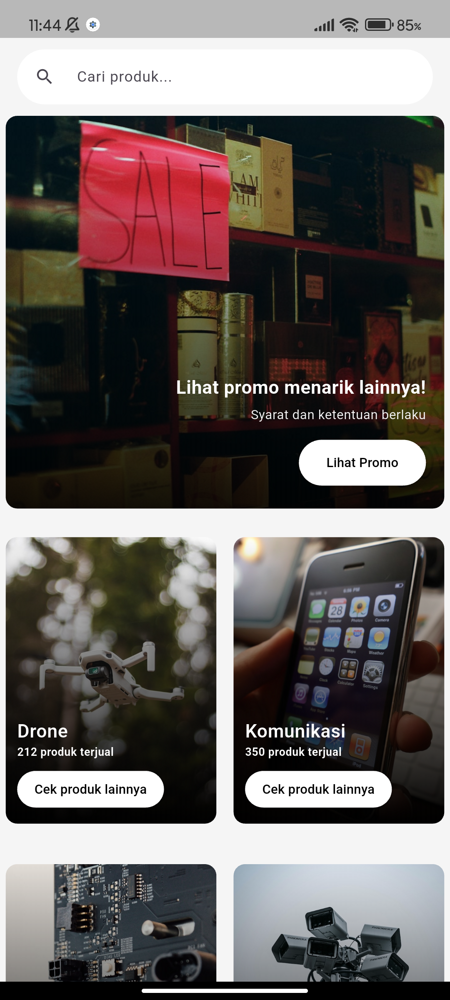
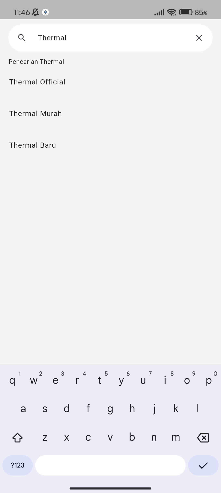

# commerce app

A Flutter application built as part of my learning journey. This project focuses on state management, UI structure, and building scalable features step by step.

🚧 This project is still under development.
UI and features may change over time.

### Screenshots
📸 Screenshots may change as development progresses.

  
  

### Features
- Display catalog item list
- Search items
- Pagination for large data sets

### Tech Stack
- Flutter
- BLoC (flutter_bloc)
- go_router (navigation)
- GetIt (dependency injection)
- Clean Architecture (basic separation, learning-focused)

### Project Status
This project is actively under development.

Currently working on:
- Implementing search functionality for catalog items
- Adding pagination to handle large data sets
- Refining state management for better data flow
- Improving UI consistency

### Next Steps
- Complete search and pagination implementation
- Improve UX for searching and browsing items
- Refine state management as features grow
- Use this project as a foundation before moving toward more complex e-commerce features

---
This project is part of my learning journey to become a better Flutter developer.
Feedback and suggestions are welcome.
